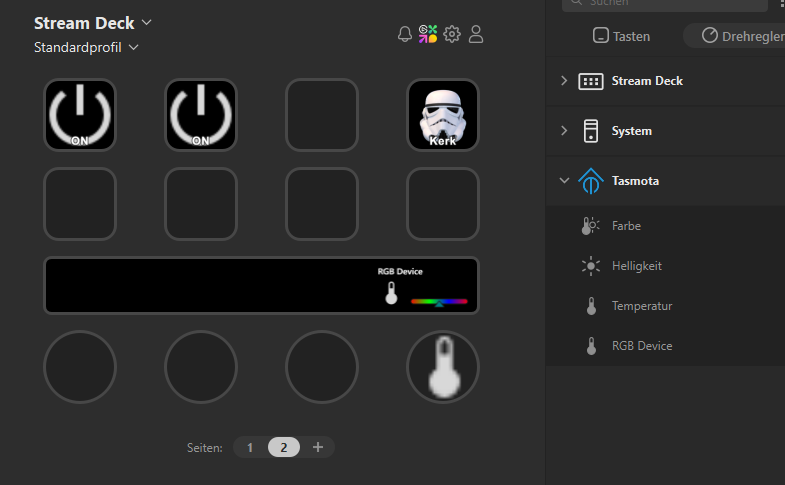

# Stream Deck Tasmota Plugin

optimized for SD+

## Description

`Stream Deck Tasmota Plugin` is a complete plugin that allows you to

- control tasmota ledstrips
- control tasmota outlets
- display tasmota device values(work in progress)

## Features

- complete control of RGBWW Leds
- granular control of RGBWW Leds
- store static values
- realtime reading on control appearance
- Same parameters over different controls are sychronized 

## Tested with
- H801 RGBWW
- NOUS A1T Outlet with Power Meter

## Quick Start Guide

* Pull your desired function on your control set
* Enter URL and credentials(optionally) of a tasmota device
* state is automatically read

