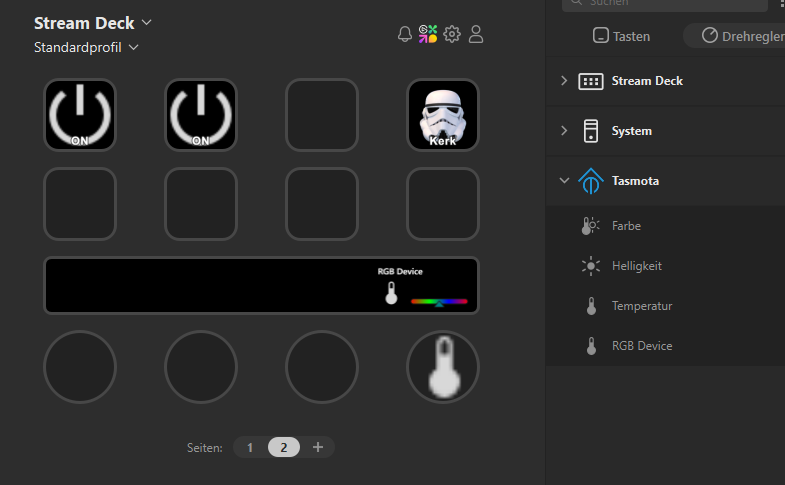
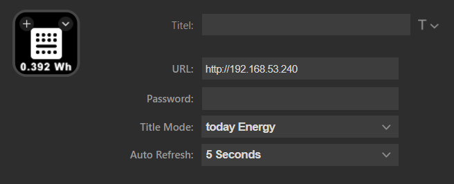
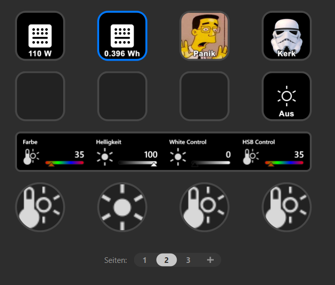

# Stream Deck Tasmota Plugin

optimized for SD+

## Description

`Stream Deck Tasmota Plugin` is a complete plugin that allows you to

- control tasmota ledstrips
- control tasmota outlets
- display tasmota power monitoring

## Features

- complete control of RGBWW Leds
- granular control of RGBWW Leds
- store static values
- realtime reading on control appearance
- Same parameters over different controls are synchronized 
- Auto polling of states
- Keep viewstate of MultiController when switching pages

## Tested with
- H801 RGBWW
- NOUS A1T Outlet with Power Meter

## Quick Start Guide

* Pull your desired function on your control set
* Enter URL and credentials(optionally) of a tasmota device
* state is automatically read

# Usage
You can use multiple controls for one device. Recieved parameters updates are dispatched to all controls of the same device.
* Use AutoRefresh if you control your devices from another point, for example: Tasmota-WebGUI or Homeautomation Software
* After changes, switch page, for reloading AutoRefresh timers
* You only need one AutoRefresh per Device

# The Controls
## Outlet Control
Functions: 
* Press: Toggle On/Off
* TitleModes: Power State, current power, today energy, total energy

## Button for static RGB Value
Functions:
* Press: set stored Color
* Hold: Toggle Power

## Button for static CWW Value
Functions:
* Press: set stored CWW
* Hold: Toggle Power

## Color-/Brightness-/Saturation Control
Functions:
* Press: Switch 0/100
* Hold: Toggle Power

## HSB Control Multi Control
Functions:
* Press: Switch through parameters
* Hold: Toggle Power
* Rotate: Change visible parameter
* Layouts: Color,Saturation,Brightness

## CW Control
Functions:
* Press: Switch through parameters
* Hold: Toggle Power
* Rotate: Change visible parameter
* Layouts: Colortemp,Brightness
